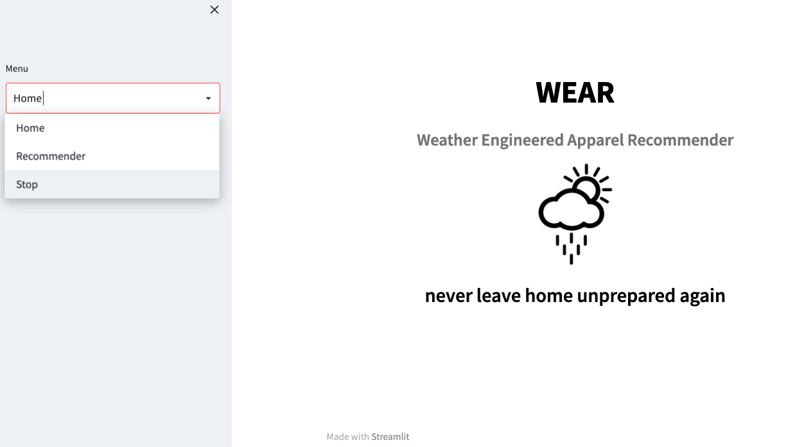
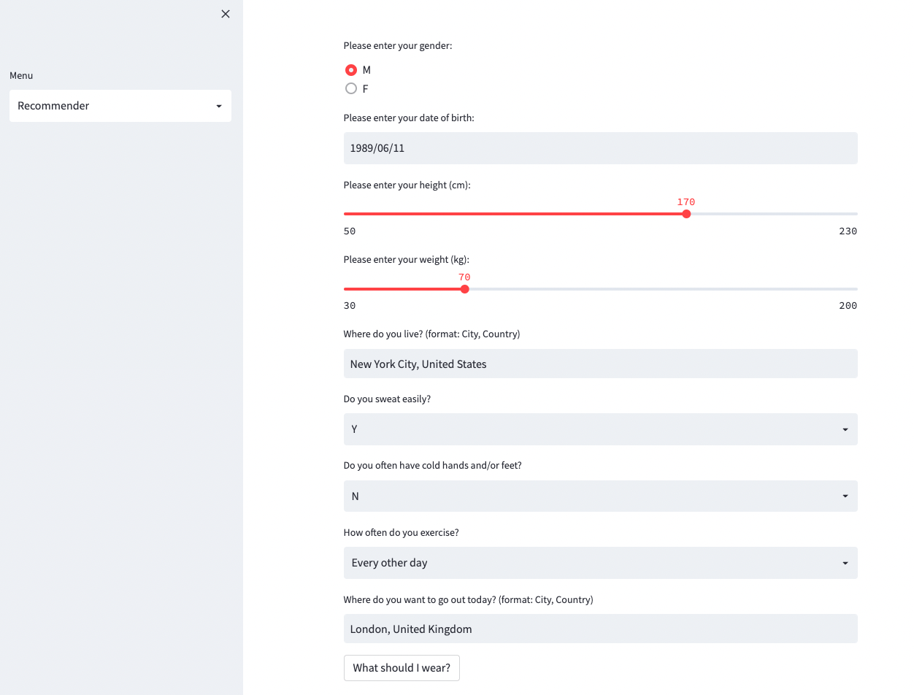
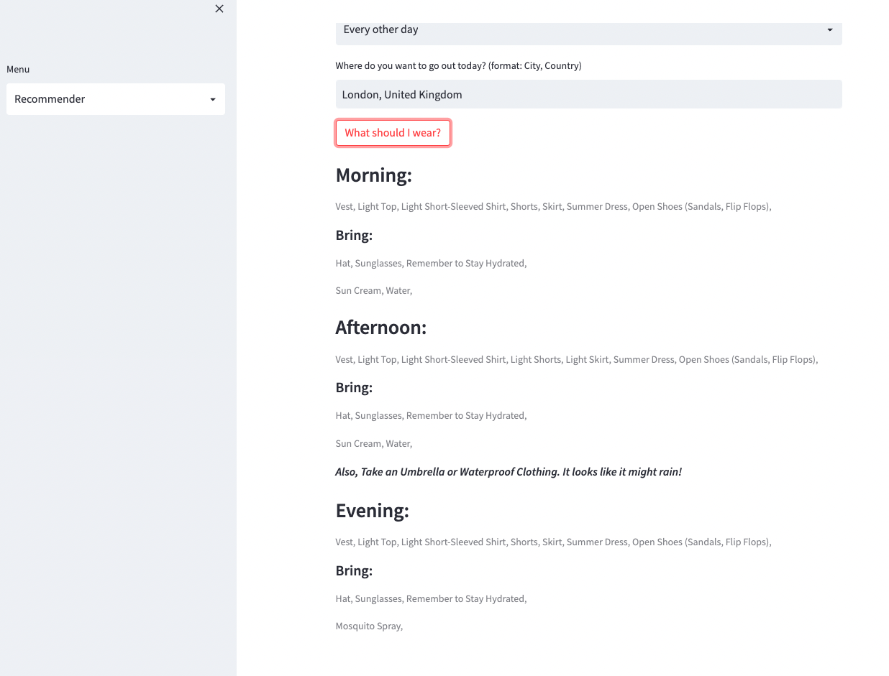

## WEAR Clothes Recommender
Recommends the clothes to wear depending on the weather and user.

## Motivation
I have found myself asking the same question: What should I wear today?

How many times have you looked out of the window and not known what types of clothes to wear? What about going out for a drink later…do you bring a jacket? Sweater?

In fact, I have had these questions so frequently, that I decided to create WEAR - **Weather Engineered Apparel Recommender**

## Code style
This notebook uses:

- Python
- APIs
- Streamlit

The notebooks included are the testing phases of the data. I also had to simulate data (accounting for biases) to test against a linear regression model, which returned 0.99 - testing shows that it confirms the logic exists within my algorithm

## Photos

**The next image shows the criteria of the program, and will serve to output our result. The home location and destination are very important, as they will vary depending on the temperature difference**

**Here we can see the output. The clothes to wear and essential items to take for the morning, afternoon, and evening (always shows the current time of day: i.e - if it's the afternoon, afternoon will appear first. It will also advise you to take an umbrella if the precipitation probability is high**

for further information about this project please see the presentation: https://docs.google.com/presentation/d/1VsOmPfjYNieaAgi7Opnb7KuJZAOU-Rn6O3HHH2YXI9o/edit#slide=id.g142a476bfa7_0_452

## How To Use
To use this program, you will need to get an API from breezometer and create an api for "Weather API v1". Once you have the API, you just need to enter it in the file : **test.py** - there are two occasions you will need to insert it

## Credits
Data was sourced from:

**API : Breezometer** *Weather Information*
https://www.breezometer.com/products/weather-api

**Geographical Information - Lat & Long**
https://public.opendatasoft.com/explore/dataset/geonames-all-cities-with-a-population-1000/information/?disjunctive.cou_name_en&sort=name

